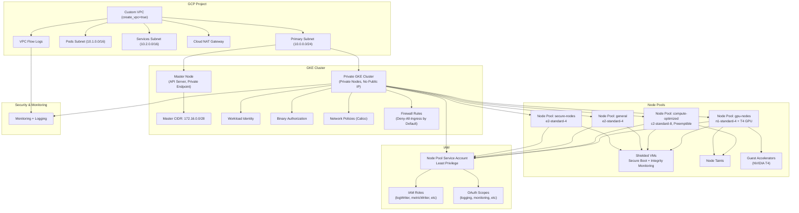

# terraform-docs

[](https://github.com/terraform-docs/terraform-docs/actions) [](https://pkg.go.dev/github.com/terraform-docs/terraform-docs) [](https://goreportcard.com/report/github.com/terraform-docs/terraform-docs) [](https://codecov.io/gh/terraform-docs/terraform-docs) [](https://github.com/terraform-docs/terraform-docs/blob/master/LICENSE) [](https://github.com/terraform-docs/terraform-docs/releases)


## What is terraform-docs

A utility to generate documentation from Terraform modules in various output formats.

## Installation

macOS users can install using [Homebrew]:

```bash
brew install terraform-docs
```

or

```bash
brew install terraform-docs/tap/terraform-docs
```

Windows users can install using [Scoop]:

```bash
scoop bucket add terraform-docs https://github.com/terraform-docs/scoop-bucket
scoop install terraform-docs
```

or [Chocolatey]:

```bash
choco install terraform-docs
```

Stable binaries are also available on the [releases] page. To install, download the
binary for your platform from "Assets" and place this into your `$PATH`:

```bash
curl -Lo ./terraform-docs.tar.gz https://github.com/terraform-docs/terraform-docs/releases/download/v0.17.0/terraform-docs-v0.17.0-$(uname)-amd64.tar.gz
tar -xzf terraform-docs.tar.gz
chmod +x terraform-docs
mv terraform-docs /usr/local/bin/terraform-docs
```

**NOTE:** Windows releases are in `ZIP` format.

The latest version can be installed using `go install` or `go get`:

```bash
# go1.17+
go install github.com/terraform-docs/terraform-docs@v0.17.0
```

```bash
# go1.16
GO111MODULE="on" go get github.com/terraform-docs/terraform-docs@v0.17.0
```

**NOTE:** please use the latest Go to do this, minimum `go1.16` is required.

This will put `terraform-docs` in `$(go env GOPATH)/bin`. If you encounter the error
`terraform-docs: command not found` after installation then you may need to either add
that directory to your `$PATH` as shown [here] or do a manual installation by cloning
the repo and run `make build` from the repository which will put `terraform-docs` in:

```bash
$(go env GOPATH)/src/github.com/terraform-docs/terraform-docs/bin/$(uname | tr '[:upper:]' '[:lower:]')-amd64/terraform-docs
```

## Usage

### Running the binary directly

To run and generate documentation into README within a directory:

```bash
terraform-docs markdown table --output-file README.md --output-mode inject /path/to/module
```

Check [`output`] configuration for more details and examples.

### Using docker

terraform-docs can be run as a container by mounting a directory with `.tf`
files in it and run the following command:

```bash
docker run --rm --volume "$(pwd):/terraform-docs" -u $(id -u) quay.io/terraform-docs/terraform-docs:0.17.0 markdown /terraform-docs
```

If `output.file` is not enabled for this module, generated output can be redirected
back to a file:

```bash
docker run --rm --volume "$(pwd):/terraform-docs" -u $(id -u) quay.io/terraform-docs/terraform-docs:0.17.0 markdown /terraform-docs > doc.md
```

**NOTE:** Docker tag `latest` refers to _latest_ stable released version and `edge`
refers to HEAD of `master` at any given point in time.

### Using GitHub Actions

To use terraform-docs GitHub Action, configure a YAML workflow file (e.g.
`.github/workflows/documentation.yml`) with the following:

```yaml
name: Generate terraform docs
on:
  - pull_request

jobs:
  docs:
    runs-on: ubuntu-latest
    steps:
    - uses: actions/checkout@v3
      with:
        ref: ${{ github.event.pull_request.head.ref }}

    - name: Render terraform docs and push changes back to PR
      uses: terraform-docs/gh-actions@main
      with:
        working-dir: .
        output-file: README.md
        output-method: inject
        git-push: "true"
```

Read more about [terraform-docs GitHub Action] and its configuration and
examples.

### pre-commit hook

With pre-commit, you can ensure your Terraform module documentation is kept
up-to-date each time you make a commit.

First [install pre-commit] and then create or update a `.pre-commit-config.yaml`
in the root of your Git repo with at least the following content:

```yaml
repos:
  - repo: https://github.com/terraform-docs/terraform-docs
    rev: "v0.17.0"
    hooks:
      - id: terraform-docs-go
        args: ["markdown", "table", "--output-file", "README.md", "./mymodule/path"]
```

Then run:

```bash
pre-commit install
pre-commit install-hooks
```

Further changes to your module's `.tf` files will cause an update to documentation
when you make a commit.

## Configuration

terraform-docs can be configured with a yaml file. The default name of this file is
`.terraform-docs.yml` and the path order for locating it is:

1. root of module directory
1. `.config/` folder at root of module directory
1. current directory
1. `.config/` folder at current directory
1. `$HOME/.tfdocs.d/`

```yaml
formatter: "" # this is required

version: ""

header-from: main.tf
footer-from: ""

recursive:
  enabled: false
  path: modules

sections:
  hide: []
  show: []

content: ""

output:
  file: ""
  mode: inject
  template: |-
    <!-- BEGIN_TF_DOCS -->
    {{ .Content }}
    <!-- END_TF_DOCS -->

output-values:
  enabled: false
  from: ""

sort:
  enabled: true
  by: name

settings:
  anchor: true
  color: true
  default: true
  description: false
  escape: true
  hide-empty: false
  html: true
  indent: 2
  lockfile: true
  read-comments: true
  required: true
  sensitive: true
  type: true
```

## Content Template

Generated content can be customized further away with `content` in configuration.
If the `content` is empty the default order of sections is used.

Compatible formatters for customized content are `asciidoc` and `markdown`. `content`
will be ignored for other formatters.

`content` is a Go template with following additional variables:

- `{{ .Header }}`
- `{{ .Footer }}`
- `{{ .Inputs }}`
- `{{ .Modules }}`
- `{{ .Outputs }}`
- `{{ .Providers }}`
- `{{ .Requirements }}`
- `{{ .Resources }}`

and following functions:

- `{{ include "relative/path/to/file" }}`

These variables are the generated output of individual sections in the selected
formatter. For example `{{ .Inputs }}` is Markdown Table representation of _inputs_
when formatter is set to `markdown table`.

Note that sections visibility (i.e. `sections.show` and `sections.hide`) takes
precedence over the `content`.

Additionally there's also one extra special variable avaialble to the `content`:

- `{{ .Module }}`

As opposed to the other variables mentioned above, which are generated sections
based on a selected formatter, the `{{ .Module }}` variable is just a `struct`
representing a [Terraform module].

````yaml
content: |-
  Any arbitrary text can be placed anywhere in the content

  {{ .Header }}

  and even in between sections

  {{ .Providers }}

  and they don't even need to be in the default order

  {{ .Outputs }}

  include any relative files

  {{ include "relative/path/to/file" }}

  {{ .Inputs }}

  # Examples

  ```hcl
  {{ include "examples/foo/main.tf" }}
  ```

  ## Resources

  {{ range .Module.Resources }}
  - {{ .GetMode }}.{{ .Spec }} ({{ .Position.Filename }}#{{ .Position.Line }})
  {{- end }}
````

## Build on top of terraform-docs

terraform-docs primary use-case is to be utilized as a standalone binary, but
some parts of it is also available publicly and can be imported in your project
as a library.

```go
import (
    "github.com/terraform-docs/terraform-docs/format"
    "github.com/terraform-docs/terraform-docs/print"
    "github.com/terraform-docs/terraform-docs/terraform"
)

// buildTerraformDocs for module root `path` and provided content `tmpl`.
func buildTerraformDocs(path string, tmpl string) (string, error) {
    config := print.DefaultConfig()
    config.ModuleRoot = path // module root path (can be relative or absolute)

    module, err := terraform.LoadWithOptions(config)
    if err != nil {
        return "", err
    }

    // Generate in Markdown Table format
    formatter := format.NewMarkdownTable(config)

    if err := formatter.Generate(module); err != nil {
        return "", err
    }

    // // Note: if you don't intend to provide additional template for the generated
    // // content, or the target format doesn't provide templating (e.g. json, yaml,
    // // xml, or toml) you can use `Content()` function instead of `Render()`.
    // // `Content()` returns all the sections combined with predefined order.
    // return formatter.Content(), nil

    return formatter.Render(tmpl)
}
```

## Plugin

Generated output can be heavily customized with [`content`], but if using that
is not enough for your use-case, you can write your own plugin.

In order to install a plugin the following steps are needed:

- download the plugin and place it in `~/.tfdocs.d/plugins` (or `./.tfdocs.d/plugins`)
- make sure the plugin file name is `tfdocs-format-<NAME>`
- modify [`formatter`] of `.terraform-docs.yml` file to be `<NAME>`

**Important notes:**

- if the plugin file name is different than the example above, terraform-docs won't
be able to to pick it up nor register it properly
- you can only use plugin thorough `.terraform-docs.yml` file and it cannot be used
with CLI arguments

To create a new plugin create a new repository called `tfdocs-format-<NAME>` with
following `main.go`:

```go
package main

import (
    _ "embed" //nolint

    "github.com/terraform-docs/terraform-docs/plugin"
    "github.com/terraform-docs/terraform-docs/print"
    "github.com/terraform-docs/terraform-docs/template"
    "github.com/terraform-docs/terraform-docs/terraform"
)

func main() {
    plugin.Serve(&plugin.ServeOpts{
        Name:    "<NAME>",
        Version: "0.1.0",
        Printer: printerFunc,
    })
}

//go:embed sections.tmpl
var tplCustom []byte

// printerFunc the function being executed by the plugin client.
func printerFunc(config *print.Config, module *terraform.Module) (string, error) {
    tpl := template.New(config,
        &template.Item{Name: "custom", Text: string(tplCustom)},
    )

    rendered, err := tpl.Render("custom", module)
    if err != nil {
        return "", err
    }

    return rendered, nil
}
```

Please refer to [tfdocs-format-template] for more details. You can create a new
repository from it by clicking on `Use this template` button.

## Documentation

- **Users**
  - Read the [User Guide] to learn how to use terraform-docs
  - Read the [Formats Guide] to learn about different output formats of terraform-docs
  - Refer to [Config File Reference] for all the available configuration options
- **Developers**
  - Read [Contributing Guide] before submitting a pull request

Visit [our website] for all documentation.

## Community

- Discuss terraform-docs on [Slack]

## License

MIT License - Copyright (c) 2021 The terraform-docs Authors.

[Chocolatey]: https://www.chocolatey.org
[Config File Reference]: https://terraform-docs.io/user-guide/configuration/
[`content`]: https://terraform-docs.io/user-guide/configuration/content/
[Contributing Guide]: CONTRIBUTING.md
[Formats Guide]: https://terraform-docs.io/reference/terraform-docs/
[`formatter`]: https://terraform-docs.io/user-guide/configuration/formatter/
[here]: https://golang.org/doc/code.html#GOPATH
[Homebrew]: https://brew.sh
[install pre-commit]: https://pre-commit.com/#install
[`output`]: https://terraform-docs.io/user-guide/configuration/output/
[releases]: https://github.com/terraform-docs/terraform-docs/releases
[Scoop]: https://scoop.sh/
[Slack]: https://slack.terraform-docs.io/
[terraform-docs GitHub Action]: https://github.com/terraform-docs/gh-actions
[Terraform module]: https://pkg.go.dev/github.com/terraform-docs/terraform-docs/terraform#Module
[tfdocs-format-template]: https://github.com/terraform-docs/tfdocs-format-template
[our website]: https://terraform-docs.io/
[User Guide]: https://terraform-docs.io/user-guide/introduction/

<!-- BEGINNING OF PRE-COMMIT-TERRAFORM-DOCS HOOK -->
# Vor Terraform - Secure GKE Infrastructure Module

This Terraform module creates a security-hardened Google Kubernetes Engine (GKE) cluster with customizable node pools, custom VPC networking, and comprehensive IAM configurations following least privilege principles.

## 🏗️ Architecture Overview

The module creates a complete secure GKE environment with:
- Private GKE cluster with enhanced security configurations
- Custom VPC with dedicated subnets and secondary IP ranges
- Private node pools with shielded VMs and secure boot
- Dedicated service accounts with minimal required permissions
- Network policies and firewall rules for secure communication
- NAT Gateway for secure outbound internet access from private nodes

## 📚 Deep Dive Documentation

- [🌐 Network security architecture](docs/components/network-header.md) | [📋 Technical Reference](docs/components/network.md)
- [🔐 IAM and security policies](docs/components/policies-header.md) | [📋 Technical Reference](docs/components/policies.md)
- [⚙️ GKE cluster configuration](docs/components/cluster-header.md) | [📋 Technical Reference](docs/components/cluster.md)
- [🖥️ Node pool security](docs/components/nodes-header.md) | [📋 Technical Reference](docs/components/nodes.md)

## Infrastructure Overview (Layout)



## 🚀 Getting Started

1. **Review the Examples**: Start with the [basic example](examples/basic/) for a simple setup or the [advanced example](examples/advanced/) for a production-ready configuration
2. **Configure Variables**: See the complete inputs documentation below for all configuration options
3. **Deploy**: Run `terraform init`, `terraform plan`, and `terraform apply`

For detailed configuration guides, see the component documentation linked above.

## Requirements

| Name | Version |
|------|---------|
| <a name="requirement_terraform"></a> [terraform](#requirement\_terraform) | >= 1.0 |
| <a name="requirement_google"></a> [google](#requirement\_google) | ~> 5.0 |
## Providers

| Name | Version |
|------|---------|
| <a name="provider_google"></a> [google](#provider\_google) | ~> 5.0 |
## Modules

No modules.
## Resources

| Name | Type |
|------|------|
| [google_compute_firewall.allow_health_checks](https://registry.terraform.io/providers/hashicorp/google/latest/docs/resources/compute_firewall) | resource |
| [google_compute_firewall.allow_internal](https://registry.terraform.io/providers/hashicorp/google/latest/docs/resources/compute_firewall) | resource |
| [google_compute_firewall.deny_all_ingress](https://registry.terraform.io/providers/hashicorp/google/latest/docs/resources/compute_firewall) | resource |
| [google_compute_network.main](https://registry.terraform.io/providers/hashicorp/google/latest/docs/resources/compute_network) | resource |
| [google_compute_router.main](https://registry.terraform.io/providers/hashicorp/google/latest/docs/resources/compute_router) | resource |
| [google_compute_router_nat.main](https://registry.terraform.io/providers/hashicorp/google/latest/docs/resources/compute_router_nat) | resource |
| [google_compute_subnetwork.main](https://registry.terraform.io/providers/hashicorp/google/latest/docs/resources/compute_subnetwork) | resource |
| [google_container_cluster.main](https://registry.terraform.io/providers/hashicorp/google/latest/docs/resources/container_cluster) | resource |
| [google_container_node_pool.main](https://registry.terraform.io/providers/hashicorp/google/latest/docs/resources/container_node_pool) | resource |
| [google_project_iam_member.main](https://registry.terraform.io/providers/hashicorp/google/latest/docs/resources/project_iam_member) | resource |
| [google_project_service.compute](https://registry.terraform.io/providers/hashicorp/google/latest/docs/resources/project_service) | resource |
| [google_project_service.container](https://registry.terraform.io/providers/hashicorp/google/latest/docs/resources/project_service) | resource |
| [google_service_account.main](https://registry.terraform.io/providers/hashicorp/google/latest/docs/resources/service_account) | resource |
## Inputs

| Name | Description | Type | Default | Required |
|------|-------------|------|---------|:--------:|
| <a name="input_additional_node_group_oauth_scopes"></a> [additional\_node\_group\_oauth\_scopes](#input\_additional\_node\_group\_oauth\_scopes) | Additional OAuth scopes for nodes | `list(string)` | `[]` | no |
| <a name="input_additional_node_group_roles"></a> [additional\_node\_group\_roles](#input\_additional\_node\_group\_roles) | Additional IAM roles for node service account | `list(string)` | `[]` | no |
| <a name="input_authorized_networks"></a> [authorized\_networks](#input\_authorized\_networks) | List of authorized networks that can access the cluster master | <pre>list(object({<br>    cidr_block   = string<br>    display_name = string<br>  }))</pre> | `[]` | no |
| <a name="input_availability_zones"></a> [availability\_zones](#input\_availability\_zones) | List of zones where nodes can be created | `list(string)` | `[]` | no |
| <a name="input_create_vpc"></a> [create\_vpc](#input\_create\_vpc) | Whether to create a new VPC or use existing network resources | `bool` | `true` | no |
| <a name="input_database_encryption_key_name"></a> [database\_encryption\_key\_name](#input\_database\_encryption\_key\_name) | KMS key name for database encryption at rest | `string` | `""` | no |
| <a name="input_enable_binary_authorization"></a> [enable\_binary\_authorization](#input\_enable\_binary\_authorization) | Enable binary authorization for container image security | `bool` | `false` | no |
| <a name="input_enable_private_endpoint"></a> [enable\_private\_endpoint](#input\_enable\_private\_endpoint) | Enable private endpoint for the cluster master (nodes are always private) | `bool` | `false` | no |
| <a name="input_gateway_api_channel"></a> [gateway\_api\_channel](#input\_gateway\_api\_channel) | GKE Gateway API config channel | `string` | `"CHANNEL_DISABLED"` | no |
| <a name="input_kubernetes_version"></a> [kubernetes\_version](#input\_kubernetes\_version) | Kubernetes version for the cluster | `string` | n/a | yes |
| <a name="input_labels"></a> [labels](#input\_labels) | Labels to apply to all node pools | `map(string)` | `{}` | no |
| <a name="input_location"></a> [location](#input\_location) | GCP zone where the cluster will be created | `string` | n/a | yes |
| <a name="input_maintenance_start_time"></a> [maintenance\_start\_time](#input\_maintenance\_start\_time) | Start time for daily maintenance window (HH:MM format) | `string` | `"02:00"` | no |
| <a name="input_master_ipv4_cidr_block"></a> [master\_ipv4\_cidr\_block](#input\_master\_ipv4\_cidr\_block) | CIDR block for the master network | `string` | `"172.16.0.0/28"` | no |
| <a name="input_name"></a> [name](#input\_name) | Name of the GKE cluster and associated resources | `string` | n/a | yes |
| <a name="input_network_self_link"></a> [network\_self\_link](#input\_network\_self\_link) | Self link of existing VPC network (when create\_vpc is false) | `string` | `""` | no |
| <a name="input_node_disk_size_gb"></a> [node\_disk\_size\_gb](#input\_node\_disk\_size\_gb) | Disk size for node pools in GB | `number` | `100` | no |
| <a name="input_node_disk_type"></a> [node\_disk\_type](#input\_node\_disk\_type) | Disk type for node pools | `string` | `"pd-balanced"` | no |
| <a name="input_node_group_defaults"></a> [node\_group\_defaults](#input\_node\_group\_defaults) | Default values for node groups | <pre>object({<br>    min_size      = number<br>    max_size      = number<br>    instance_type = string<br>    preemptible   = optional(bool, false)<br>    node_taints = optional(list(object({<br>      key    = string<br>      value  = string<br>      effect = string<br>    })), [])<br>    guest_accelerators = optional(list(object({<br>      name               = string<br>      count              = number<br>      gpu_partition_size = optional(string, "")<br>    })), [])<br>    labels = optional(map(string), {})<br>  })</pre> | <pre>{<br>  "guest_accelerators": [],<br>  "instance_type": "e2-standard-2",<br>  "labels": {},<br>  "max_size": 3,<br>  "min_size": 1,<br>  "node_taints": [],<br>  "preemptible": false<br>}</pre> | no |
| <a name="input_node_groups"></a> [node\_groups](#input\_node\_groups) | List of node pool configurations | <pre>list(object({<br>    name          = string<br>    min_size      = number<br>    max_size      = number<br>    instance_type = string<br>    preemptible   = optional(bool, false)<br>    node_taints = optional(list(object({<br>      key    = string<br>      value  = string<br>      effect = string<br>    })), [])<br>    guest_accelerators = optional(list(object({<br>      name               = string<br>      count              = number<br>      gpu_partition_size = optional(string, "")<br>      gpu_driver_version = optional(string, "")<br>    })), [])<br>    labels = optional(map(string), {})<br>  }))</pre> | <pre>[<br>  {<br>    "guest_accelerators": [],<br>    "instance_type": "e2-standard-2",<br>    "labels": {},<br>    "max_size": 3,<br>    "min_size": 1,<br>    "name": "default",<br>    "node_taints": [],<br>    "preemptible": false<br>  }<br>]</pre> | no |
| <a name="input_pods_secondary_range_name"></a> [pods\_secondary\_range\_name](#input\_pods\_secondary\_range\_name) | Name of secondary range for pods (when using existing VPC) | `string` | `""` | no |
| <a name="input_pods_subnet_cidr"></a> [pods\_subnet\_cidr](#input\_pods\_subnet\_cidr) | CIDR range for pods secondary subnet | `string` | `"10.1.0.0/16"` | no |
| <a name="input_primary_subnet_cidr"></a> [primary\_subnet\_cidr](#input\_primary\_subnet\_cidr) | CIDR range for the primary subnet | `string` | `"10.0.0.0/24"` | no |
| <a name="input_project_id"></a> [project\_id](#input\_project\_id) | GCP project ID where resources will be created | `string` | n/a | yes |
| <a name="input_rbac_security_group"></a> [rbac\_security\_group](#input\_rbac\_security\_group) | Security group for RBAC authenticator | `string` | `""` | no |
| <a name="input_region"></a> [region](#input\_region) | GCP region for regional resources | `string` | n/a | yes |
| <a name="input_release_channel"></a> [release\_channel](#input\_release\_channel) | GKE release channel | `string` | `"STABLE"` | no |
| <a name="input_services_secondary_range_name"></a> [services\_secondary\_range\_name](#input\_services\_secondary\_range\_name) | Name of secondary range for services (when using existing VPC) | `string` | `""` | no |
| <a name="input_services_subnet_cidr"></a> [services\_subnet\_cidr](#input\_services\_subnet\_cidr) | CIDR range for services secondary subnet | `string` | `"10.2.0.0/16"` | no |
| <a name="input_subnetwork_self_link"></a> [subnetwork\_self\_link](#input\_subnetwork\_self\_link) | Self link of existing subnetwork (when create\_vpc is false) | `string` | `""` | no |
| <a name="input_tags"></a> [tags](#input\_tags) | Network tags for node pools | `list(string)` | `[]` | no |
## Outputs

| Name | Description |
|------|-------------|
| <a name="output_cluster_ca_certificate"></a> [cluster\_ca\_certificate](#output\_cluster\_ca\_certificate) | Base64 encoded cluster CA certificate |
| <a name="output_cluster_endpoint"></a> [cluster\_endpoint](#output\_cluster\_endpoint) | Endpoint for the GKE cluster |
| <a name="output_cluster_name"></a> [cluster\_name](#output\_cluster\_name) | Name of the GKE cluster |
| <a name="output_cluster_security_features"></a> [cluster\_security\_features](#output\_cluster\_security\_features) | Security features enabled on the cluster |
| <a name="output_kubeconfig"></a> [kubeconfig](#output\_kubeconfig) | Kubeconfig for connecting to kubernetes cluster |
| <a name="output_node_pools"></a> [node\_pools](#output\_node\_pools) | List of node pool names |
| <a name="output_service_account_email"></a> [service\_account\_email](#output\_service\_account\_email) | Email of the service account used by node pools |
| <a name="output_subnet_id"></a> [subnet\_id](#output\_subnet\_id) | ID of the subnet |
| <a name="output_vpc_id"></a> [vpc\_id](#output\_vpc\_id) | ID of the VPC network |

## License

This module is licensed under the Apache 2.0 License. See [LICENSE](LICENSE) for
details.
<!-- END OF PRE-COMMIT-TERRAFORM-DOCS HOOK -->