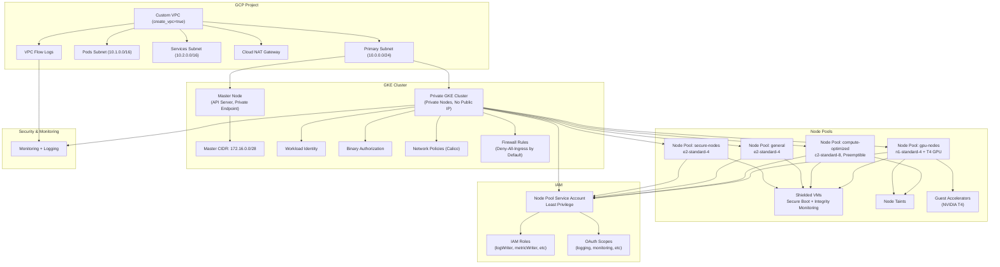

<!-- BEGINNING OF PRE-COMMIT-TERRAFORM-DOCS HOOK -->
<!-- This section will be automatically populated by terraform-docs -->
<!-- END OF PRE-COMMIT-TERRAFORM-DOCS HOOK -->

<!-- BEGIN_TF_DOCS -->
# Vor Terraform - Secure GKE Infrastructure Module

This Terraform module creates a security-hardened Google Kubernetes Engine (GKE) cluster with customizable node pools, custom VPC networking, and comprehensive IAM configurations following least privilege principles.

## 🏗️ Architecture Overview

The module creates a complete secure GKE environment with:
- Private GKE cluster with enhanced security configurations
- Custom VPC with dedicated subnets and secondary IP ranges
- Private node pools with shielded VMs and secure boot
- Dedicated service accounts with minimal required permissions
- Network policies and firewall rules for secure communication
- NAT Gateway for secure outbound internet access from private nodes

## 📚 Deep Dive Documentation

- [🌐 Network security architecture](docs/components/network-header.md) | [📋 Technical Reference](docs/components/network.md)
- [🔐 IAM and security policies](docs/components/policies-header.md) | [📋 Technical Reference](docs/components/policies.md)
- [⚙️ GKE cluster configuration](docs/components/cluster-header.md) | [📋 Technical Reference](docs/components/cluster.md)
- [🖥️ Node pool security](docs/components/nodes-header.md) | [📋 Technical Reference](docs/components/nodes.md)

## Infrastructure Overview (Layout)

## ⚡ Quick Reference

| Variable             | Type     | Description                                      |
| -------------------- | -------- | ------------------------------------------------ |
| `name`               | `string` | Name of the GKE cluster and associated resources |
| `location`           | `string` | GCP zone where the cluster will be created       |
| `region`             | `string` | GCP region for regional resources                |
| `project_id`         | `string` | GCP project ID where resources will be created   |
| `kubernetes_version` | `string` | Kubernetes version for the cluster               |

**📖 [Complete Variable Reference](docs/components/)** - Detailed documentation for all variables and configuration options

## 🏷️ Resource Labeling

All infrastructure resources are automatically labeled for tracking, cost allocation, and management. You can add custom labels that will be merged with the standard ones.

**📖 [Complete Labeling Guide](.labeling-conventions.md)** - Detailed labeling conventions and best practices

## Requirements

| Name | Version |
|------|---------|
|  [terraform](#requirement\_terraform) | >= 1.0 |
|  [google](#requirement\_google) | ~> 5.0 |
## Providers

| Name | Version |
|------|---------|
|  [google](#provider\_google) | ~> 5.0 |
## Modules

No modules.
## Resources

| Name | Type |
|------|------|
| [google_compute_firewall.allow_health_checks](https://registry.terraform.io/providers/hashicorp/google/latest/docs/resources/compute_firewall) | resource |
| [google_compute_firewall.allow_internal](https://registry.terraform.io/providers/hashicorp/google/latest/docs/resources/compute_firewall) | resource |
| [google_compute_firewall.deny_all_ingress](https://registry.terraform.io/providers/hashicorp/google/latest/docs/resources/compute_firewall) | resource |
| [google_compute_network.main](https://registry.terraform.io/providers/hashicorp/google/latest/docs/resources/compute_network) | resource |
| [google_compute_router.main](https://registry.terraform.io/providers/hashicorp/google/latest/docs/resources/compute_router) | resource |
| [google_compute_router_nat.main](https://registry.terraform.io/providers/hashicorp/google/latest/docs/resources/compute_router_nat) | resource |
| [google_compute_subnetwork.main](https://registry.terraform.io/providers/hashicorp/google/latest/docs/resources/compute_subnetwork) | resource |
| [google_container_cluster.main](https://registry.terraform.io/providers/hashicorp/google/latest/docs/resources/container_cluster) | resource |
| [google_container_node_pool.main](https://registry.terraform.io/providers/hashicorp/google/latest/docs/resources/container_node_pool) | resource |
| [google_project_iam_member.main](https://registry.terraform.io/providers/hashicorp/google/latest/docs/resources/project_iam_member) | resource |
| [google_project_service.compute](https://registry.terraform.io/providers/hashicorp/google/latest/docs/resources/project_service) | resource |
| [google_project_service.container](https://registry.terraform.io/providers/hashicorp/google/latest/docs/resources/project_service) | resource |
| [google_service_account.main](https://registry.terraform.io/providers/hashicorp/google/latest/docs/resources/service_account) | resource |
## Inputs

| Name | Description | Type | Default | Required |
|------|-------------|------|---------|:--------:|
|  [additional\_node\_group\_oauth\_scopes](#input\_additional\_node\_group\_oauth\_scopes) | Additional OAuth scopes for nodes | `list(string)` | `[]` | no |
|  [additional\_node\_group\_roles](#input\_additional\_node\_group\_roles) | Additional IAM roles for node service account | `list(string)` | `[]` | no |
|  [authorized\_networks](#input\_authorized\_networks) | List of authorized networks that can access the cluster master | <pre>list(object({     cidr_block   = string     display_name = string   }))</pre> | `[]` | no |
|  [availability\_zones](#input\_availability\_zones) | List of zones where nodes can be created | `list(string)` | `[]` | no |
|  [create\_vpc](#input\_create\_vpc) | Whether to create a new VPC or use existing network resources | `bool` | `true` | no |
|  [database\_encryption\_key\_name](#input\_database\_encryption\_key\_name) | KMS key name for database encryption at rest | `string` | `""` | no |
|  [enable\_binary\_authorization](#input\_enable\_binary\_authorization) | Enable binary authorization for container image security | `bool` | `false` | no |
|  [enable\_private\_endpoint](#input\_enable\_private\_endpoint) | Enable private endpoint for the cluster master (nodes are always private) | `bool` | `false` | no |
|  [kubernetes\_version](#input\_kubernetes\_version) | Kubernetes version for the cluster | `string` | n/a | yes |
|  [labels](#input\_labels) | Labels to apply to all node pools | `map(string)` | `{}` | no |
|  [location](#input\_location) | GCP zone where the cluster will be created | `string` | n/a | yes |
|  [maintenance\_start\_time](#input\_maintenance\_start\_time) | Start time for daily maintenance window (HH:MM format) | `string` | `"02:00"` | no |
|  [master\_ipv4\_cidr\_block](#input\_master\_ipv4\_cidr\_block) | CIDR block for the master network | `string` | `"172.16.0.0/28"` | no |
|  [name](#input\_name) | Name of the GKE cluster and associated resources | `string` | n/a | yes |
|  [network\_self\_link](#input\_network\_self\_link) | Self link of existing VPC network (when create\_vpc is false) | `string` | `""` | no |
|  [node\_disk\_size\_gb](#input\_node\_disk\_size\_gb) | Disk size for node pools in GB | `number` | `100` | no |
|  [node\_disk\_type](#input\_node\_disk\_type) | Disk type for node pools | `string` | `"pd-balanced"` | no |
|  [node\_group\_defaults](#input\_node\_group\_defaults) | Default values for node groups | <pre>object({     min_size      = number     max_size      = number     instance_type = string     preemptible   = optional(bool, false)     node_taints = optional(list(object({       key    = string       value  = string       effect = string     })), [])     guest_accelerators = optional(list(object({       name               = string       count              = number       gpu_partition_size = optional(string, "")     })), [])     labels = optional(map(string), {})   })</pre> | <pre>{   "guest_accelerators": [],   "instance_type": "e2-standard-2",   "labels": {},   "max_size": 3,   "min_size": 1,   "node_taints": [],   "preemptible": false }</pre> | no |
|  [node\_groups](#input\_node\_groups) | List of node pool configurations | <pre>list(object({     name          = string     min_size      = number     max_size      = number     instance_type = string     preemptible   = optional(bool, false)     node_taints = optional(list(object({       key    = string       value  = string       effect = string     })), [])     guest_accelerators = optional(list(object({       name               = string       count              = number       gpu_partition_size = optional(string, "")       gpu_driver_version = optional(string, "")     })), [])     labels = optional(map(string), {})   }))</pre> | <pre>[   {     "guest_accelerators": [],     "instance_type": "e2-standard-2",     "labels": {},     "max_size": 3,     "min_size": 1,     "name": "default",     "node_taints": [],     "preemptible": false   } ]</pre> | no |
|  [pods\_secondary\_range\_name](#input\_pods\_secondary\_range\_name) | Name of secondary range for pods (when using existing VPC) | `string` | `""` | no |
|  [pods\_subnet\_cidr](#input\_pods\_subnet\_cidr) | CIDR range for pods secondary subnet | `string` | `"10.1.0.0/16"` | no |
|  [primary\_subnet\_cidr](#input\_primary\_subnet\_cidr) | CIDR range for the primary subnet | `string` | `"10.0.0.0/24"` | no |
|  [project\_id](#input\_project\_id) | GCP project ID where resources will be created | `string` | n/a | yes |
|  [rbac\_security\_group](#input\_rbac\_security\_group) | Security group for RBAC authenticator | `string` | `""` | no |
|  [region](#input\_region) | GCP region for regional resources | `string` | n/a | yes |
|  [release\_channel](#input\_release\_channel) | GKE release channel | `string` | `"STABLE"` | no |
|  [services\_secondary\_range\_name](#input\_services\_secondary\_range\_name) | Name of secondary range for services (when using existing VPC) | `string` | `""` | no |
|  [services\_subnet\_cidr](#input\_services\_subnet\_cidr) | CIDR range for services secondary subnet | `string` | `"10.2.0.0/16"` | no |
|  [subnetwork\_self\_link](#input\_subnetwork\_self\_link) | Self link of existing subnetwork (when create\_vpc is false) | `string` | `""` | no |
|  [tags](#input\_tags) | Network tags for node pools | `list(string)` | `[]` | no |
## Outputs

| Name | Description |
|------|-------------|
|  [cluster\_ca\_certificate](#output\_cluster\_ca\_certificate) | Base64 encoded cluster CA certificate |
|  [cluster\_endpoint](#output\_cluster\_endpoint) | Endpoint for the GKE cluster |
|  [cluster\_name](#output\_cluster\_name) | Name of the GKE cluster |
|  [cluster\_security\_features](#output\_cluster\_security\_features) | Security features enabled on the cluster |
|  [kubeconfig](#output\_kubeconfig) | Kubeconfig for connecting to kubernetes cluster |
|  [node\_pools](#output\_node\_pools) | List of node pool names |
|  [service\_account\_email](#output\_service\_account\_email) | Email of the service account used by node pools |
|  [subnet\_id](#output\_subnet\_id) | ID of the subnet |
|  [vpc\_id](#output\_vpc\_id) | ID of the VPC network |

## Contributing

Please read the contribution guidelines before submitting changes. All source code files must include appropriate copyright headers - see [COPYRIGHT.md](COPYRIGHT.md) for details.

## License

This module is licensed under the Apache 2.0 License. See [LICENSE](LICENSE) for details.
<!-- END_TF_DOCS -->