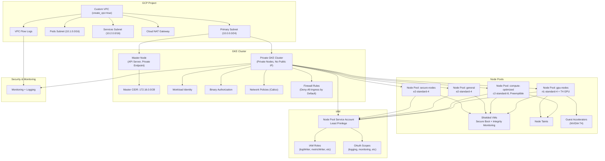

# Vor Terraform - Secure GKE Infrastructure Module

This Terraform module creates a security-hardened Google Kubernetes Engine (GKE) cluster with customizable node pools, custom VPC networking, and comprehensive IAM configurations following least privilege principles.

## 🏗️ Architecture Overview

The module creates a complete secure GKE environment with:
- Private GKE cluster with enhanced security configurations
- Custom VPC with dedicated subnets and secondary IP ranges
- Private node pools with shielded VMs and secure boot
- Dedicated service accounts with minimal required permissions
- Network policies and firewall rules for secure communication
- NAT Gateway for secure outbound internet access from private nodes

## 📚 Deep Dive Documentation

- [🌐 Network security architecture](docs/components/network-header.md) | [📋 Technical Reference](docs/components/network.md)
- [🔐 IAM and security policies](docs/components/policies-header.md) | [📋 Technical Reference](docs/components/policies.md)
- [⚙️ GKE cluster configuration](docs/components/cluster-header.md) | [📋 Technical Reference](docs/components/cluster.md)
- [🖥️ Node pool security](docs/components/nodes-header.md) | [📋 Technical Reference](docs/components/nodes.md)

## Infrastructure Overview (Layout)

## 🚀 Getting Started

1. **Review the Examples**: Start with the [basic example](examples/basic/) for a simple setup or the [advanced example](examples/advanced/) for a production-ready configuration
2. **Configure Variables**: See the complete inputs documentation below for all configuration options
3. **Deploy**: Run `terraform init`, `terraform plan`, and `terraform apply`

For detailed configuration guides, see the component documentation linked above.
